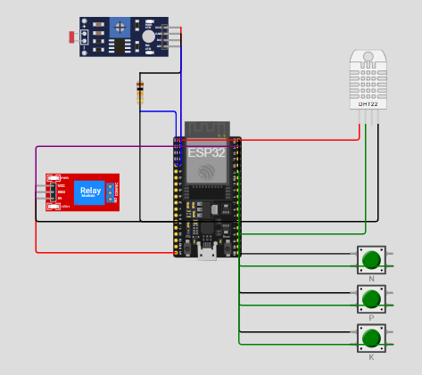

# FarmTech Solutions - Fase 2

Sistema de irrigação inteligente para **goiaba** com **ESP32 no Wokwi**, integração manual com **Python** para previsão meteorológica e análise estatística em **R**.

## 1. Objetivo

O projeto simula uma fazenda inteligente na propriedade **Ouro Verde, em Carlópolis/PR**, usando:

- **3 botões verdes** para representar os níveis de **N, P e K**;
- **LDR** como substituto didático para o **pH do solo**;
- **DHT22** como substituto didático para **umidade do solo**;
- **Relé azul** como acionamento da **bomba d'água**.

> **Importante:** este projeto é uma **simulação acadêmica**. O DHT22 mede umidade do ar, não do solo, e o LDR mede luz, não pH. O uso deles aqui é exclusivamente didático.

## 2. Base técnica e documental

A lógica foi construída com base em referências técnicas e institucionais:

- **Embrapa**: faixa de pH adequada para goiabeira, importância da irrigação e manejo de água;
- **IBGE / Paraná**: relevância de Carlópolis para a goiaba;
- **MAPA**: contexto regulatório de cultivares e produção integrada;
- **Conab / Cepea**: contexto de mercado hortifrutícola, útil para justificar eficiência operacional e redução de perdas.

## 3. Lógica do sistema

### Variáveis monitoradas

- **N, P, K**: cada botão pressionado = nutriente em nível adequado.
- **pH estimado**: obtido do LDR e mapeado para faixa **4.0 a 8.0**.
- **Umidade**: obtida do DHT22 e tratada como proxy de umidade do solo.
- **Chuva prevista**: informada via Serial com dados vindos do script Python.

### Regras de decisão do relé/bomba

1. **Liga a bomba** se a umidade estiver **< 50%** e **não houver chuva prevista relevante**.
2. **Liga a bomba** se a umidade estiver entre **50% e 65%**, **sem chuva prevista**, com **pH entre 5.5 e 7.0** e com pelo menos **2 nutrientes adequados**.
3. **Desliga a bomba** quando:
   - houver previsão de chuva relevante (`chance >= 60%` ou `rainMm >= 2.0 mm`), ou
   - a umidade estiver adequada, ou
   - o sistema estiver fora da faixa química mínima definida para a simulação.

> **Observação importante:** os limiares de umidade são **didáticos**, porque o sensor utilizado não é de solo. O projeto usa a literatura agronômica como referência de manejo, mas a automação final foi simplificada para caber no Wokwi.

## 4. Estrutura do repositório

```text
fase2/
├── README.md
├── esp32/
│   └── sketch.ino
├── wokwi/
│   └── diagram.json
├── python/
│   └── weather_fetch.py
├── r/
│   └── decision_stats.R
└── serial_log.csv
```

## 5. Ligações do circuito no Wokwi

### ESP32
- DHT22 data -> GPIO 15
- Botão N -> GPIO 18
- Botão P -> GPIO 19
- Botão K -> GPIO 21
- LDR analógico -> GPIO 34
- Relé -> GPIO 23

### Alimentação
- DHT22 em 3V3
- Relé em 5V
- GND comum para todos os componentes

## 6. Como executar

### ESP32 / Wokwi
1. Crie um projeto ESP32 no Wokwi.
2. Cole o conteúdo de `esp32/sketch.ino`.
3. Cole o conteúdo de `wokwi/diagram.json` no arquivo `diagram.json`.
4. Inicie a simulação.
5. Use os botões, o LDR e o DHT22 para alterar as condições.

### Python
1. Execute:
   ```bash
   python python/weather_fetch.py
   ```
2. O script vai retornar algo como:
   ```text
   CHANCE=72
   RAINMM=3.40
   ```
3. Copie esses comandos para o **Monitor Serial** do Wokwi.

### R
1. Copie as linhas que começam com `CSV,` no Serial Monitor.
2. Monte um arquivo `serial_log.csv` com o cabeçalho:
   ```csv
   timestamp,humidity,ph,n,p,k,rainChance,rainMm,pump
   ```
3. Execute:
   ```bash
   Rscript r/decision_stats.R
   ```

## 7. Imagens do circuito

Adicione aqui as capturas do Wokwi:

```md


```

## 8. Roteiro sugerido do vídeo

1. Mostrar o circuito no Wokwi.
2. Explicar os sensores simulados.
3. Acionar/desacionar N, P e K.
4. Alterar o LDR para mudar o "pH".
5. Alterar o DHT22 para mudar a "umidade".
6. Rodar o script Python e enviar `CHANCE=` e `RAINMM=` no Serial.
7. Mostrar o relé ligando/desligando.
8. Rodar o script em R com o CSV coletado.
9. Mostrar a decisão estatística final.

## 9. Link do vídeo

Substitua abaixo pelo link do YouTube não listado:

```text
https://youtube.com/seu-video-aqui
```

## 10. Referências sugeridas para citar no relatório/README

- Embrapa - publicações sobre goiabeira, pH e irrigação.
- IDR-Paraná / SEAB-PR - contexto regional da goiaba em Carlópolis.
- IBGE - Produção Agrícola Municipal / indicação geográfica.
- MAPA - registro de cultivares e normas de produção.
- Conab / Prohort - mercado hortigranjeiro.
- Cepea / Hortifruti Brasil - contexto de mercado e eficiência produtiva.
- Open-Meteo - API pública de previsão do tempo.
